<p align="center">
  
</p>

<h1 align="center">🚗 CloudDrive Agentforce — Plataforma de Locação de Veículos</h1>

<p align="center">
  <strong>Agentforce Implementation Challenge</strong><br/>
  Implementação de um Agente Inteligente para atendimento ao cliente utilizando Salesforce Agentforce Builder
</p>

<p align="center">
  
  
  
  
</p>

---

## 📋 Sumário

- [Visão Geral do Projeto](#-visão-geral-do-projeto)
- [Cenário: CloudDrive](#-cenário-clouddrive)
- [Arquitetura da Solução](#-arquitetura-da-solução)
- [Configuração do Agent](#-configuração-do-agent)
- [Problemas Resolvidos](#-problemas-resolvidos-55)
  - [Problema 1 — Busca de Veículos Disponíveis](#problema-1--busca-de-veículos-disponíveis)
  - [Problema 2 — Abertura de Chamado de Suporte](#problema-2--abertura-de-chamado-de-suporte)
  - [Problema 3 — Consulta de Políticas e Regras](#problema-3--consulta-de-políticas-e-regras)
  - [Problema 4 — Consulta de Status de Reserva](#problema-4--consulta-de-status-de-reserva)
  - [Problema 5 — Cadastro de Novo Cliente](#problema-5--cadastro-de-novo-cliente)
- [Topics Configurados](#-topics-configurados)
- [Actions Implementadas (Apex)](#-actions-implementadas-apex)
- [GenAi Functions](#-genai-functions)
- [Trigger Apex](#-trigger-apex)
- [Funcionalidades Extras](#-funcionalidades-extras)
- [Variáveis de Contexto](#-variáveis-de-contexto)
- [Estrutura do Projeto](#-estrutura-do-projeto)
- [Teste e Demonstração](#-teste-e-demonstração)
- [Screenshots](#-screenshots)

---

## 🎯 Visão Geral do Projeto

Este projeto implementa um **Agentforce Agent funcional** chamado **CloudDrive Assistant**, capaz de ajudar clientes da CloudDrive a resolver problemas reais durante o processo de locação de veículos. 

O agente foi construído utilizando o **Agentforce Builder** no Salesforce, combinando:

- **Topics** para categorizar e rotear as intenções do cliente
- **Instructions** para guiar o comportamento do agente em cada cenário
- **Actions** (Invocable Methods em Apex) para executar operações reais no banco de dados Salesforce
- **GenAi Functions** para conectar as ações ao motor de IA generativa do Agentforce

> **Todos os 5 problemas propostos no desafio foram resolvidos.**

---

## 🏢 Cenário: CloudDrive

A **CloudDrive** é uma empresa global de locação de veículos que utiliza o Salesforce como plataforma central de atendimento e operação. O agente foi projetado para ser acessado por meio de uma **interface conversacional**, interpretando solicitações em **português brasileiro** e respondendo de forma cordial e objetiva.

### Papel do Agente (Role)

> *"Assistente virtual da CloudDrive, locação de veículos. Ajude clientes a: buscar veículos, abrir chamados, tirar dúvidas de políticas, ver reservas e se cadastrar. Responda em português, seja cordial e objetivo."*

### Dados da Configuração

| Propriedade | Valor |
|---|---|
| **Nome do Agent** | CloudDrive Assistant |
| **Tipo** | Agentforce Employee Agent |
| **Idioma Primário** | Português (Brasil) - `pt_BR` |
| **Tom de Conversa** | Casual |
| **Empresa** | CloudDrive |
| **Rich Content** | Habilitado |
| **Mensagem de Boas-vindas** | "Hi, I'm Agentforce! I use AI to search trusted sources, and more..." |

---

## 🏗 Arquitetura da Solução

A solução foi projetada seguindo uma arquitetura modular com separação clara de responsabilidades:

```
┌─────────────────────────────────────────────────────────────────┐
│                    AGENTFORCE BUILDER                           │
│                                                                 │
│  ┌──────────────────────────────────────────────────────────┐   │
│  │                CloudDrive Assistant (Bot)                │   │
│  │                    Role + Instructions                   │   │
│  └──────────────┬───────────────────────────┬───────────────┘   │
│                 │                           │                   │
│  ┌──────────────▼──────────┐  ┌────────────▼──────────────── ┐  │
│  │      TOPICS (5)         │  │     VARIÁVEIS DE CONTEXTO    │  │
│  │                         │  │                              │  │
│  │ • Vehicle Availability  │  │ • customerEmail              │  │
│  │   Search                │  │ • currentRecordId            │  │
│  │ • Vehicle Reservation   │  │ • VerifiedCustomerId         │  │
│  │ • Support Ticket        │  │ • currentObjectApiName       │  │
│  │   Creation              │  │ • currentPageType            │  │
│  │ • Policy Information    │  │                              │  │
│  │ • Customer Registration │  │                              │  │
│  └──────────┬──────────────┘  └──────────────────────────────┘  │
│             │                                                   │
│  ┌──────────▼──────────────────────────────────────────────┐    │
│  │            ACTIONS (10 Apex Invocable Methods)          │    │
│  │                                                         │    │
│  │ • Buscar_Veiculos_Disponiveis_V2  →  Apex Invocable     │    │
│  │ • Get_Reservation_Status          →  Apex Invocable     │    │
│  │ • Create Support Ticket           →  Apex Invocable     │    │
│  │ • Get Policy Information          →  Apex Invocable     │    │
│  │ • Register Customer               →  Apex Invocable     │    │
│  │ • Cancel Vehicle Reservation      →  Apex Invocable     │    │
│  │ • Escalate to Human Agent         →  Apex Invocable     │    │
│  │ • Submit Customer Feedback        →  Apex Invocable     │    │
│  │ • Get Customer Context            →  Apex Invocable     │    │
│  │ • Create Vehicle Reservation      →  Apex Invocable     │    │
│  └──────────┬──────────────────────────────────────────────┘    │
│             │                                                   │
└─────────────┼───────────────────────────────────────────────────┘
              │
┌─────────────▼─────────────────────────────────────────────── ─────┐
│                      APEX LAYER (Backend)                         │
│                                                                   │
│  ┌────────────────────────┐  ┌──────────────────────────────┐     │
│  │ CloudDriveVehicleActions│  │ CloudDriveReservationActions│     │
│  │ (Busca de veículos)    │  │ (Criação de reservas)        │     │
│  └────────────────────────┘  └──────────────────────────────┘     │
│  ┌────────────────────────┐  ┌──────────────────────────────┐     │
│  │ CloudDriveSupportActions│  │ CloudDrivePolicyActions     │     │
│  │ (Abertura de chamados) │  │ (Políticas e preços)         │     │
│  └────────────────────────┘  └──────────────────────────────┘     │
│  ┌────────────────────────┐  ┌──────────────────────────────┐     │
│  │ CloudDriveCustomer     │  │ CloudDriveReservationQuery   │     │
│  │ Registration           │  │ (Consulta de reservas)       │     │
│  │ (Cadastro de clientes) │  └──────────────────────────────┘     │
│  └────────────────────────┘                                       │
│  ┌────────────────────────┐                                       │
│  │ CloudDriveAgentContext │                                       │
│  │ (Contexto do cliente)  │                                       │
│  └────────────────────────┘  ┌──────────────────────────────┐     │
│  ┌────────────────────────┐  │ CloudDriveFeedbackActions    │     │
│  │ CloudDriveCancelRes.   │  │ (Avaliações de clientes)     │     │
│  │ (Cancelar reservas)    │  └──────────────────────────────┘     │
│  └────────────────────────┘  ┌──────────────────────────────┐     │
│  ┌────────────────────────┐  │ CloudDriveEscalationActions  │     │
│  │ BookingTrigger         │  │ (Escalação para humanos)     │     │
│  │ (Auto-confirma reserva)│  └──────────────────────────────┘     │
│  └────────────────────────┘                                       │
│                                                                   │
│  ┌─────────────────────────────────────────────────────────────┐  │
│  │                    SALESFORCE DATABASE                      │  │
│  │  Contact | Vehicle__c | Reservation__c | Case | Feedback__c │  │
│  └─────────────────────────────────────────────────────────────┘  │
└───────────────────────────────────────────────────────────────────┘
```

---

## ⚙ Configuração do Agent

O agente **CloudDrive Assistant** foi configurado no Agentforce Builder com os seguintes parâmetros:

### Informações Gerais

| Configuração | Valor |
|---|---|
| **Label** | CloudDrive Assistant |
| **API Name** | `CloudDrive_Assistant` |
| **Template** | Agentforce Employee Agent |
| **Idioma** | Português (Brasil) |
| **Tom** | Casual |
| **Company** | CloudDrive |

### Diálogos Configurados

| Diálogo | Função |
|---|---|
| **Welcome** | Mensagem de boas-vindas ao iniciar a conversa |
| **Error_Handling** | Tratamento de erros do sistema - reinicia a conversa |
| **Transfer_To_Agent** | Transferência para um representante humano quando necessário |

---

## ✅ Problemas Resolvidos (5/5)

O agente foi configurado para resolver **todos os 5 problemas** propostos no desafio. Abaixo está a documentação detalhada de cada um:

---

### Problema 1 — Busca de Veículos Disponíveis

> **Exemplo:** *"Quais carros estão disponíveis em São Paulo amanhã?"*

#### Como o Agent Resolve

1. O **Topic** de busca de veículos identifica a intenção do cliente
2. O agente extrai as informações: **cidade**, **data de início** e opcionalmente **data de fim** e **categoria**
3. A **GenAi Function** `Buscar_Veiculos_Disponiveis_V2` é invocada
4. O Apex `CloudDriveVehicleActions.searchVehicles()` executa uma query SOQL no objeto `Vehicle__c`
5. Retorna uma lista formatada com: nome, categoria e diária de cada veículo

#### Classe Apex: `CloudDriveVehicleActions`

| Método | `searchVehicles` |
|---|---|
| **Label** | Search Available Vehicles |
| **Tipo** | `@InvocableMethod` |
| **Descrição** | Busca veículos disponíveis por cidade e período |

**Parâmetros de entrada:**

| Parâmetro | Tipo | Obrigatório | Descrição |
|---|---|---|---|
| `city` | String | ✅ | Cidade para busca (ex: São Paulo, Rio de Janeiro) |
| `startDate` | String | ✅ | Data início no formato `YYYY-MM-DD` ou `DD/MM/YYYY` |
| `endDate` | String | ❌ | Data fim (padrão: dia seguinte à data início) |
| `vehicleCategory` | String | ❌ | Categoria: SUV, Sedan, Luxury, Van ou Electric |

**Saída formatada:**
```
Veículos disponíveis em São Paulo de 27/02/2026 até 28/02/2026:
1. Toyota Corolla 2024 | Categoria: Sedan | Diária: R$ 150,00
2. Honda HR-V 2024 | Categoria: SUV | Diária: R$ 220,00
3. Tesla Model 3 | Categoria: Electric | Diária: R$ 350,00
```

**Funcionalidades técnicas:**
- Normalização de caracteres acentuados para busca (ex: "São Paulo" → match com "Sao Paulo")
- Suporte a dois formatos de data (`YYYY-MM-DD` e `DD/MM/YYYY`)
- Filtro opcional por categoria de veículo
- Query cruzada entre `Vehicle__c` e `Location__r` para buscar por cidade

#### GenAi Function: `Buscar_Veiculos_Disponiveis_V2`

| Propriedade | Valor |
|---|---|
| **Label** | Buscar Veiculos Disponiveis V2 |
| **Target** | `CloudDriveVehicleActions` (Apex) |
| **Confirmação** | Não requerida |
| **Indicador de Progresso** | "Buscando veículos disponíveis..." |

---

### Problema 2 — Abertura de Chamado de Suporte

> **Exemplo:** *"Fui cobrado duas vezes pela minha reserva."*

#### Como o Agent Resolve

1. O **Topic** de suporte ao cliente identifica a reclamação
2. O agente coleta: **assunto**, **descrição do problema**, e opcionalmente **email**, **número da reserva** e **prioridade**
3. A Action `Create Support Ticket` é invocada
4. O Apex `CloudDriveSupportActions.createCase()` cria um registro `Case` no Salesforce
5. Retorna o número do chamado e confirmação ao cliente

#### Classe Apex: `CloudDriveSupportActions`

| Método | `createCase` |
|---|---|
| **Label** | Create Support Ticket |
| **Tipo** | `@InvocableMethod` |
| **Descrição** | Cria um chamado de suporte no Salesforce para o cliente |

**Parâmetros de entrada:**

| Parâmetro | Tipo | Obrigatório | Descrição |
|---|---|---|---|
| `subject` | String | ✅ | Assunto do chamado |
| `description` | String | ✅ | Descrição detalhada do problema |
| `contactEmail` | String | ❌ | Email do cliente |
| `reservationNumber` | String | ❌ | Número da reserva relacionada |
| `priority` | String | ❌ | Prioridade: High, Medium ou Low (padrão: Medium) |

**Saída formatada:**
```
## Chamado Aberto com Sucesso!

**Número do Chamado:** 00001234
**Status:** Novo
**Assunto:** Cobrança duplicada [Reserva: RES-12345678]
**Prioridade:** High

Nossa equipe de suporte analisará seu caso e entrará em contato em até **24 horas**.

Posso ajudar com mais alguma coisa?
```

**Funcionalidades técnicas:**
- Origin do Case definido como `Agentforce` para rastreamento
- Associação automática da reserva ao assunto do chamado
- Resposta com formatação Markdown para apresentação rica

---

### Problema 3 — Consulta de Políticas e Regras

> **Exemplo:** *"Qual é a política de cancelamento?"*

#### Como o Agent Resolve

1. O **Topic** de políticas identifica a intenção de consulta
2. O agente identifica o **tipo de política** desejada
3. A Action `Get Policy Information` é invocada
4. O Apex `CloudDrivePolicyActions.getPolicyInfo()` retorna as informações solicitadas
5. O agente apresenta a política de forma clara ao cliente

#### Classe Apex: `CloudDrivePolicyActions`

| Método | `getPolicyInfo` |
|---|---|
| **Label** | Get Policy Information |
| **Tipo** | `@InvocableMethod` |
| **Descrição** | Retorna informações sobre políticas da CloudDrive |

**Parâmetros de entrada:**

| Parâmetro | Tipo | Obrigatório | Descrição |
|---|---|---|---|
| `policyType` | String | ❌ | Tipo: `RENTAL`, `CANCELLATION`, `INSURANCE`, `PRICING` ou `ALL` |
| `vehicleCategory` | String | ❌ | Categoria do veículo para precificação |
| `customerId` | String | ❌ | ID do cliente para personalização |

**Políticas implementadas:**

##### 📋 Política de Locação
- Idade mínima: 21 anos (taxa adicional para menores de 25 anos)
- CNH válida com mínimo 2 anos
- Cartão de crédito em nome do locatário
- Combustível: devolução com mesmo nível de abastecimento
- Quilometragem: livre (sem restrição de KM)

##### ❌ Política de Cancelamento
| Antecedência | Taxa |
|---|---|
| Mais de 48h antes da retirada | **Gratuito** |
| Entre 24-48h | Multa de **20%** do valor total |
| Menos de 24h | Multa de **50%** do valor total |
| No-show (não retirada) | Cobrança de **100%** do valor |

##### 🛡️ Opções de Seguro
| Plano | Cobertura | Valor Adicional |
|---|---|---|
| **Básico** (incluso) | Contra terceiros | Incluso |
| **Intermediário** | Completa com franquia de R$1.500 | +R$30/dia |
| **Premium** | Total sem franquia | +R$55/dia |

##### 💰 Tabela de Preços (por dia)
| Categoria | Faixa de Preço |
|---|---|
| Economy | R$89 - R$120 |
| Standard | R$120 - R$180 |
| SUV | R$180 - R$280 |
| Luxury | R$350 - R$600 |

---

### Problema 4 — Consulta de Status de Reserva

> **Exemplo:** *"Qual é o status da minha reserva?"*

#### Como o Agent Resolve

1. O **Topic** de reservas identifica a intenção de consulta
2. O agente solicita o **número da reserva**
3. A **GenAi Function** `Get_Reservation_Status` é invocada
4. O Apex `CloudDriveReservationQuery.getReservationStatus()` busca no objeto `Reservation__c`
5. Retorna detalhes completos: veículo, status, datas e valor total

#### Classe Apex: `CloudDriveReservationQuery`

| Método | `getReservationStatus` |
|---|---|
| **Label** | Get Reservation Status |
| **Tipo** | `@InvocableMethod` |
| **Descrição** | Consulta uma reserva pelo número de confirmação |

**Parâmetros de entrada:**

| Parâmetro | Tipo | Obrigatório | Descrição |
|---|---|---|---|
| `reservationNumber` | String | ✅ | Número da reserva (ex: `RES-12345678` ou `R-001`) |

**Saída formatada:**
```
Reserva: RES-12345678
Veículo: Toyota Corolla 2024
Status: Confirmed
Retirada: 01/03/2026
Devolução: 05/03/2026
Total: R$ 600,00
```

**Funcionalidades técnicas:**
- Busca por `Reservation_Number__c`, `Name` (autonumber) ou busca parcial com LIKE
- Retorna veículo associado, cliente, status, datas e custo total
- Tratamento de erros com mensagens amigáveis em português

#### GenAi Function: `Get_Reservation_Status`

| Propriedade | Valor |
|---|---|
| **Label** | Get Reservation Status |
| **Target** | `CloudDriveReservationQuery` (Apex) |
| **Confirmação** | Não requerida |
| **Indicador de Progresso** | "Consultando reserva..." |

---

### Problema 5 — Cadastro de Novo Cliente

> **Exemplo:** *"Quero me cadastrar."*

#### Como o Agent Resolve

1. O **Topic** de cadastro identifica a intenção do cliente
2. O agente conduz o fluxo de cadastro, coletando: **nome completo**, **email**, e opcionalmente **telefone**, **CPF**, **data de nascimento** e **CNH**
3. A Action `Register Customer` é invocada
4. O Apex `CloudDriveCustomerRegistration.registerCustomer()` cria um registro `Contact`
5. Retorna confirmação com número de cadastro

#### Classe Apex: `CloudDriveCustomerRegistration`

| Método | `registerCustomer` |
|---|---|
| **Label** | Register Customer |
| **Tipo** | `@InvocableMethod` |
| **Descrição** | Cadastra um novo cliente na plataforma CloudDrive |

**Parâmetros de entrada:**

| Parâmetro | Tipo | Obrigatório | Descrição |
|---|---|---|---|
| `fullName` | String | ✅ | Nome completo do cliente |
| `email` | String | ✅ | Email do cliente |
| `phone` | String | ❌ | Telefone do cliente |
| `cpf` | String | ❌ | Número do CPF |
| `birthDate` | String | ❌ | Data de nascimento (`YYYY-MM-DD`) |
| `driversLicense` | String | ❌ | Número da CNH |

**Funcionalidades técnicas:**
- Verificação de duplicidade por email antes do cadastro
- Parsing automático do nome em `FirstName` e `LastName`
- Armazenamento de CPF e CNH no campo `Description` do Contact
- Geração de número de cadastro único (`CD-XXXXXXXX`)
- Resposta com resumo completo do cadastro

**Saída esperada:**
```
Cliente João Silva cadastrado com sucesso na CloudDrive. 
Número: CD-12345678. 
Agora pode realizar reservas de veículos.
```

---

## 📂 Topics Configurados (5)

Os Topics organizam as intenções do cliente e direcionam para as ações corretas. Cada Topic possui suas **Instructions** (instruções de comportamento) e **Actions** (ações executáveis).

| # | Topic | Problema | Actions Associadas |
|---|---|---|---|
| 1 | **Vehicle Availability Search** | P1 | Buscar Veículos Disponíveis V2 |
| 2 | **Vehicle Reservation** | P4 + Extra | Get Reservation Status, Cancel Vehicle Reservation, Create Vehicle Reservation |
| 3 | **Support Ticket Creation** | P2 | Abrir Chamado de Suporte, Escalate to Human Agent |
| 4 | **Policy Information** | P3 | Get Policy Information, Submit Customer Feedback |
| 5 | **Customer Registration** | P5 | Get Customer Context, Register Customer |

---

## ⚡ Actions Implementadas (10 Apex Classes)

Todas as Actions foram implementadas como **Invocable Methods** em classes Apex, permitindo sua invocação pelo Agentforce. Das 12 classes Apex no projeto, **10 são utilizadas como Actions** no Agent:

| # | Classe Apex | Label da Action | Topic | Descrição Funcional |
|---|---|---|---|---|
| 1 | `CloudDriveVehicleActions` | Search Available Vehicles | Vehicle Availability Search | Busca veículos disponíveis por cidade, datas e categoria |
| 2 | `CloudDriveSupportActions` | Create Support Ticket | Support Ticket Creation | Cria chamado de suporte (Case) com origem Agentforce |
| 3 | `CloudDrivePolicyActions` | Get Policy Information | Policy Information | Retorna políticas de locação, cancelamento, seguro e preços |
| 4 | `CloudDriveReservationQuery` | Get Reservation Status | Vehicle Reservation | Consulta status e detalhes de uma reserva existente |
| 5 | `CloudDriveCustomerRegistration` | Register Customer | Customer Registration | Cadastra novo cliente criando um registro Contact |
| 6 | `CloudDriveCancelReservation` | Cancel Vehicle Reservation | Vehicle Reservation | Cancela reserva e libera veículo, aplicando política de cancelamento |
| 7 | `CloudDriveEscalationActions` | Escalate to Human Agent | Support Ticket Creation | Escala atendimento para agente humano criando Case de alta prioridade |
| 8 | `CloudDriveFeedbackActions` | Submit Customer Feedback | Policy Information | Registra avaliação (1-5 estrelas) e comentários do cliente |
| 9 | `CloudDriveAgentContext` | Get Customer Context | Customer Registration | Obtém contexto completo do cliente: reservas ativas, histórico |
| 10 | `CloudDriveReservationActions` | Create Vehicle Reservation | Vehicle Reservation | Cria nova reserva de veículo com cálculo automático de custo |

> **Nota:** As classes `CloudDriveCheckReservationStatus` e `CloudDriveSupportLookup` existem no projeto mas não foram configuradas como Actions no Agent.

---

## 🧠 GenAi Functions

As GenAi Functions conectam as classes Apex ao motor de IA do Agentforce, permitindo que o agente invoque as ações de forma inteligente:

| GenAi Function | Apex Target | Indicador de Progresso |
|---|---|---|
| **Buscar_Veiculos_Disponiveis_V2** | `CloudDriveVehicleActions` | *"Buscando veículos disponíveis..."* |
| **Get_Reservation_Status** | `CloudDriveReservationQuery` | *"Consultando reserva..."* |

### Schemas de Input/Output

Cada GenAi Function possui schemas JSON que definem a estrutura de dados de entrada e saída, permitindo ao motor de IA mapear corretamente os dados da conversa para os parâmetros do Apex.

---

## 🔄 Trigger Apex

### `BookingTrigger`

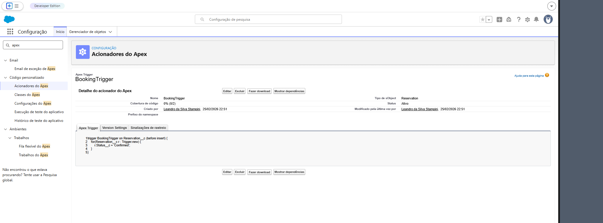

| Propriedade | Valor |
|---|---|
| **Objeto** | `Reservation__c` |
| **Evento** | `before insert` |
| **Função** | Define automaticamente o status da reserva como `Confirmed` |

```apex
trigger BookingTrigger on Reservation__c (before insert) {
    for(Reservation__c r : Trigger.new) {
        r.Status__c = 'Confirmed';
    }
}
```

Este trigger garante que toda nova reserva criada (seja pelo Agent ou manualmente) inicie automaticamente com o status **Confirmed**, proporcionando uma experiência consistente.

---

## 🌟 Funcionalidades Extras

Além dos 5 problemas obrigatórios, a implementação inclui funcionalidades adicionais que enriquecem a experiência do cliente:

### 1. Cancelamento de Reservas (`CloudDriveCancelReservation`)
- Cancelamento por número de reserva (`RES-XXXXXXXXX`), ID Salesforce ou Name (autonumber)
- Aplicação automática da política de cancelamento (gratuito com mais de 24h de antecedência)
- Liberação automática do veículo associado (status volta para `Available`)

### 2. Escalação para Agente Humano (`CloudDriveEscalationActions`)
- Cria Case de escalação com prioridade configurável
- Vincula automaticamente o Contact quando encontrado por email
- Inclui número da reserva relacionada na descrição

### 3. Feedback e Avaliação (`CloudDriveFeedbackActions`)
- Sistema de avaliação de 1 a 5 estrelas
- Armazenamento em objeto customizado `Feedback__c`
- Mensagem de resposta personalizada conforme a nota

### 4. Contexto do Cliente (`CloudDriveAgentContext`)
- Busca Contact por email
- Retorna resumo completo: nome, reservas ativas, total de reservas, última reserva
- Permite ao agente personalizar respostas com base no histórico

### 5. Criação de Reserva (`CloudDriveReservationActions`)
- Fluxo completo de criação de reserva
- Busca de Contact por nome e Vehicle por nome/ID
- Cálculo automático do custo total (diárias × dias)
- Geração de número único de confirmação (`RES-XXXXXXXXX`)
- Atualização automática do status do veículo para `Reserved`

---

## 🔗 Variáveis de Contexto

### Configuração do Context  


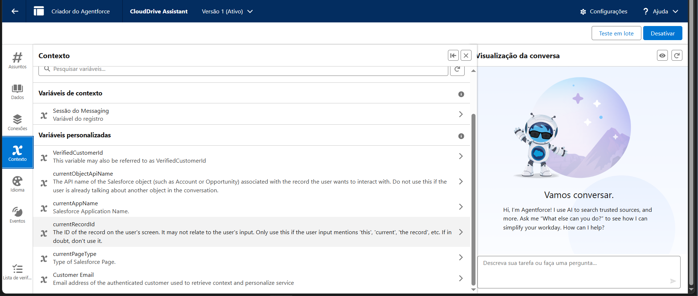 

---


O agente utiliza variáveis de contexto para enriquecer as interações:

| Variável | Tipo | No Prompt | Descrição |
|---|---|---|---|
| `customerEmail` | Text | ✅ | Email do cliente autenticado |
| `currentRecordId` | Text | ✅ | ID do registro na tela do usuário |
| `currentObjectApiName` | Text | ✅ | Nome da API do objeto Salesforce |
| `currentAppName` | Text | ✅ | Nome do aplicativo Salesforce |
| `currentPageType` | Text | ✅ | Tipo de página Salesforce |
| `VerifiedCustomerId` | Text | ❌ | ID verificado do cliente |
| `VoiceCallId` | Id | ✅ | ID de chamada de voz |
| `EndUserId` | Id | ✅ | ID do end user de messaging |
| `RoutableId` | Id | ✅ | ID da sessão de messaging |
| `EndUserLanguage` | Text | ❌ | Idioma do end user |
| `ContactId` | Id | ❌ | ID do Contact do end user |

---

## 📁 Estrutura do Projeto

```
CloudDrive_Agentforce/
│
├── force-app/
│   └── main/
│       └── default/
│           ├── bots/
│           │   └── CloudDrive_Assistant/
│           │       ├── CloudDrive_Assistant.bot-meta.xml      # Configuração do Bot
│           │       └── v1.botVersion-meta.xml                 # Versão com Topics/Instructions
│           │
│           ├── classes/
│           │   ├── CloudDriveVehicleActions.cls                # P1: Busca de veículos
│           │   ├── CloudDriveSupportActions.cls                # P2: Abertura de chamado
│           │   ├── CloudDrivePolicyActions.cls                 # P3: Políticas e regras
│           │   ├── CloudDriveReservationQuery.cls              # P4: Status de reserva
│           │   ├── CloudDriveCustomerRegistration.cls          # P5: Cadastro de cliente
│           │   ├── CloudDriveCancelReservation.cls             # Extra: Cancelar reserva
│           │   ├── CloudDriveEscalationActions.cls             # Extra: Escalação humana
│           │   ├── CloudDriveFeedbackActions.cls               # Extra: Feedback/avaliação
│           │   ├── CloudDriveAgentContext.cls                  # Extra: Contexto do cliente
│           │   ├── CloudDriveReservationActions.cls            # Extra: Criar reserva
│           │   ├── CloudDriveSupportLookup.cls                 # Extra: Consultar chamado
│           │   └── CloudDriveCheckReservationStatus.cls        # Stub futuro
│           │
│           ├── genAiFunctions/
│           │   ├── Buscar_Veiculos_Disponiveis_V2/            # GenAi Function
│           │   │   ├── Buscar_Veiculos_Disponiveis_V2.genAiFunction-meta.xml
│           │   │   ├── input/schema.json
│           │   │   └── output/schema.json
│           │   └── Get_Reservation_Status/                    # GenAi Function
│           │       ├── Get_Reservation_Status.genAiFunction-meta.xml
│           │       ├── input/schema.json
│           │       └── output/schema.json
│           │
│           └── triggers/
│               └── BookingTrigger.trigger                     # Auto-confirma reservas
│
├── img/                                                       # Screenshots do desafio
│
├── sfdx-project.json
└── README.md                                                  # Este documento
```

---

## 🧪 Teste e Demonstração

O agente foi testado diretamente no **Agentforce Builder** (Agent Preview) cobrindo os seguintes cenários:

### Cenários de Teste

| # | Cenário | Entrada do Cliente | Resultado Esperado |
|---|---|---|---|
| 1 | Buscar veículos | *"Quais carros tem em São Paulo amanhã?"* | Lista de veículos com preços |
| 2 | Abrir chamado | *"Fui cobrado duas vezes pela reserva RES-123"* | Case criado com número |
| 3 | Consultar política | *"Qual a política de cancelamento?"* | Detalhes completos da política |
| 4 | Status da reserva | *"Status da reserva RES-12345678?"* | Detalhes: veículo, datas, valor |
| 5 | Cadastrar | *"Quero me cadastrar"* | Fluxo de cadastro com confirmação |

> Os screenshots das conversas de teste estão na seção abaixo.

---

## 📸 Screenshots

> **Instrução:** Coloque seus prints na pasta `img/` na raiz do projeto e eles serão referenciados abaixo.

### Configuração do Agent


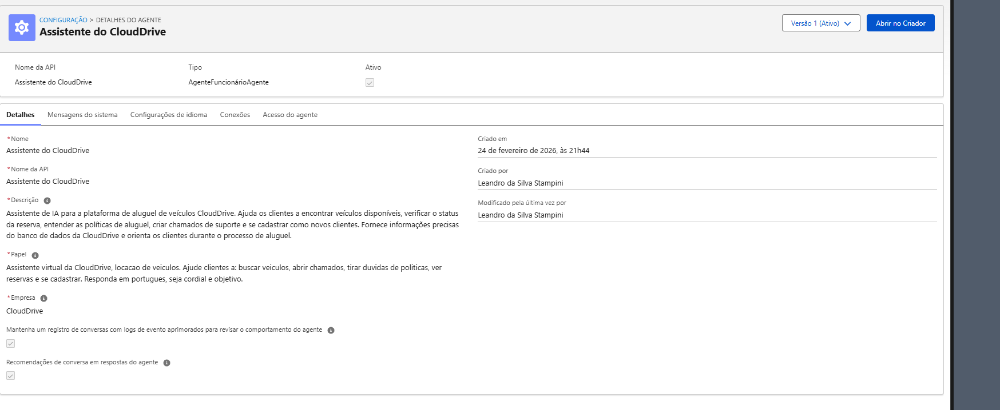 

---

### Configuração do Topic Vehicle Availability Search


 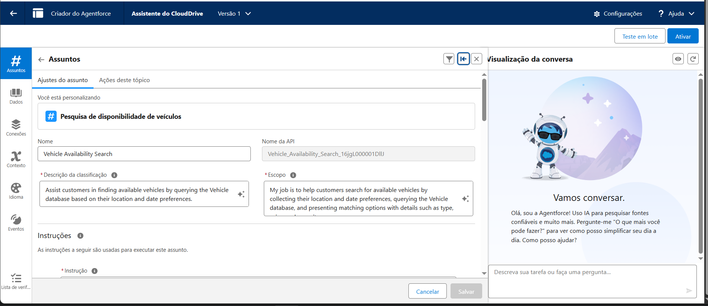 
 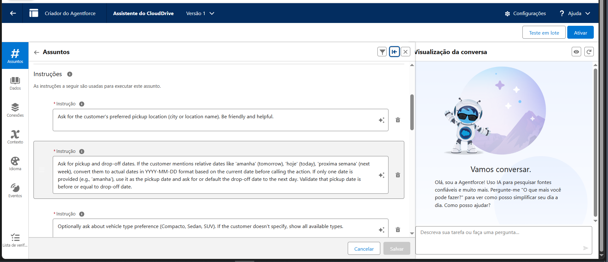 
  
 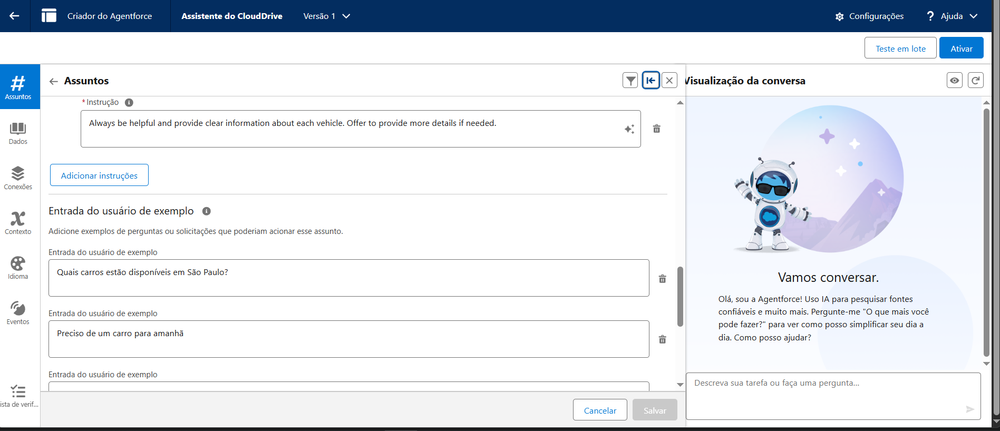 
 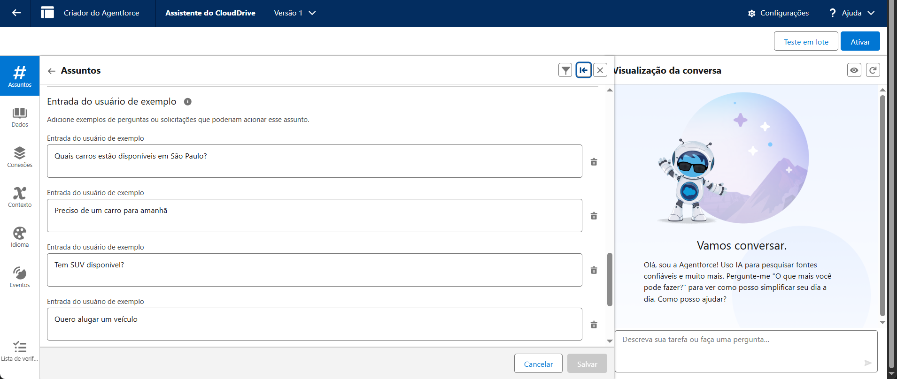 
 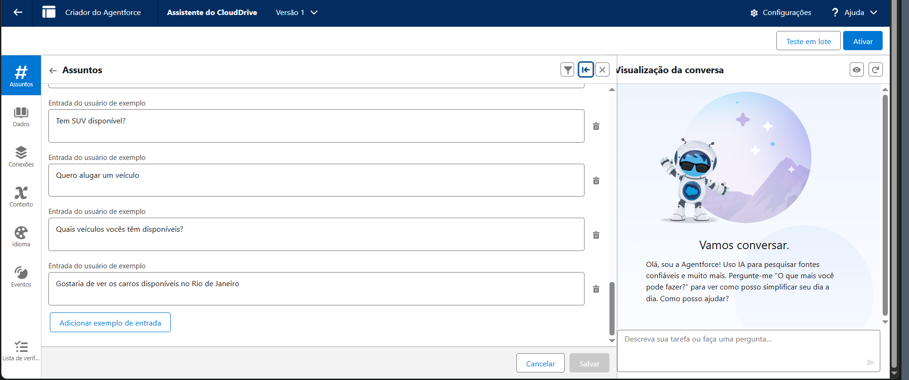 

---

### Configuração da Action Buscar Veiculos Disponiveis V2

**Classe Apex:** `CloudDriveVehicleActions.cls`

```apex
public with sharing class CloudDriveVehicleActions {

    public class VehicleSearchRequest {
        @InvocableVariable(required=true label='City')
        public String city;
        @InvocableVariable(required=true label='Start Date')
        public String startDate;
        @InvocableVariable(label='End Date')
        public String endDate;
        @InvocableVariable(label='Vehicle Category')
        public String vehicleCategory;
    }

    @InvocableMethod(label='Search Available Vehicles'
        description='Search available vehicles by city and date range.')
    public static List<VehicleSearchResponse> searchVehicles(
            List<VehicleSearchRequest> requests) {
        // Normaliza cidade, parse de datas (YYYY-MM-DD ou DD/MM/YYYY)
        // Query em Vehicle__c filtrando por Available_From__c, Available_To__c e Status__c = 'Available'
        // Filtra por cidade via Location__r.City__c (com normalização de acentos)
        // Filtra opcionalmente por Category__c
        // Retorna lista formatada: Nome | Categoria | Diária: R$ X
    }
}
```


 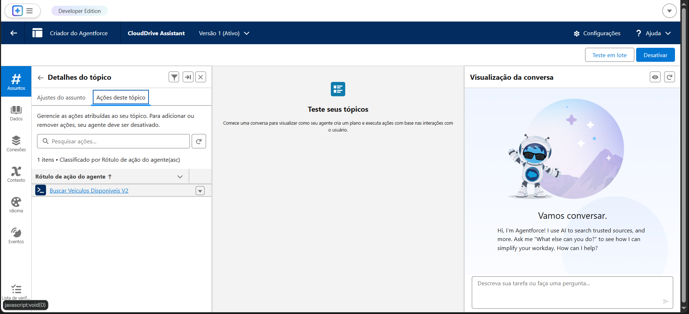 
  
 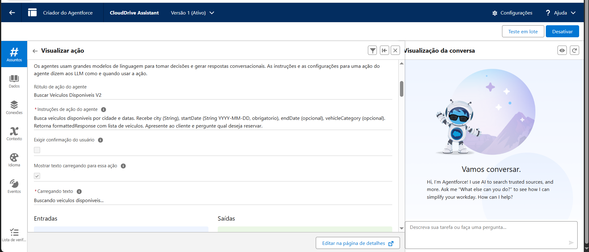 
 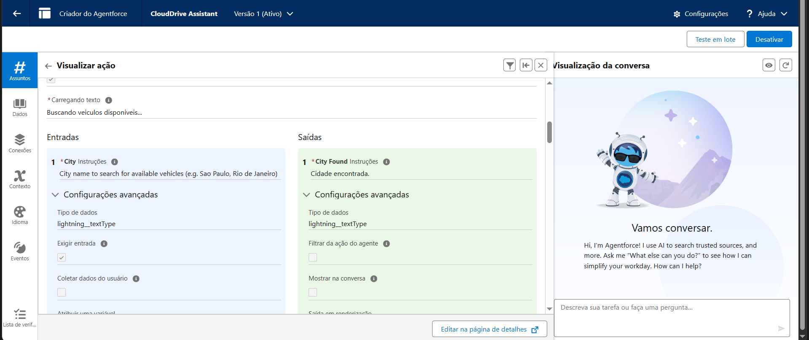 
  
 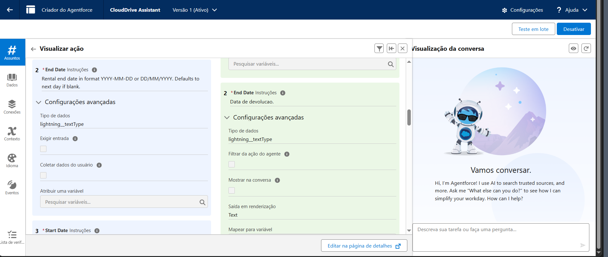 
 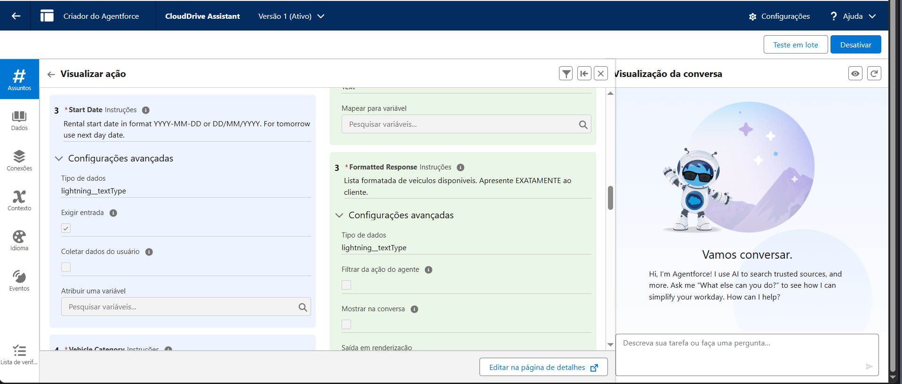 
 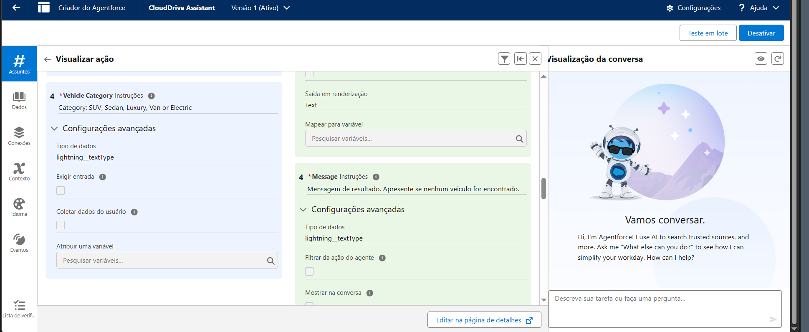 
 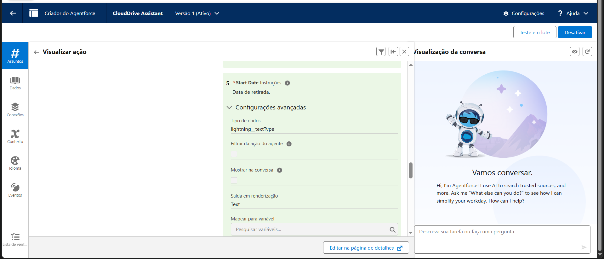 

---

### Configuração do Topic Vehicle Reservation
 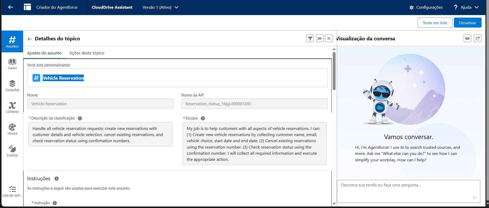 
  
 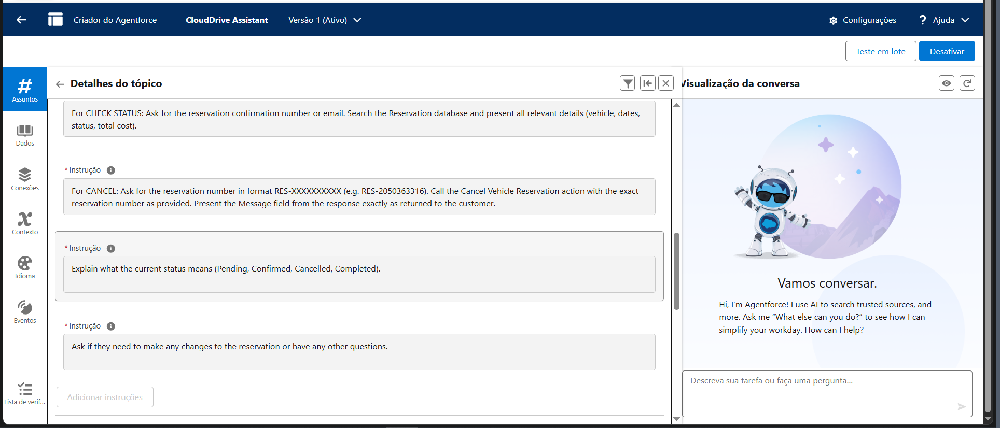 
 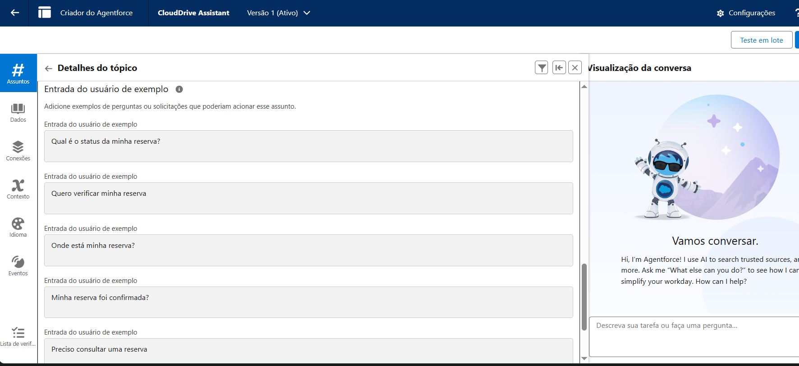 

---

### Configuração da Action Cancel Vehicle Reservation

**Classe Apex:** `CloudDriveCancelReservation.cls`

```apex
public with sharing class CloudDriveCancelReservation {

    public class CancelReservationRequest {
        @InvocableVariable(required=true label='Reservation Number'
            description='Reservation number (RES-XXXXXXXXX) or Salesforce ID to cancel')
        public String reservationNumber;
    }

    @InvocableMethod(label='Cancel Vehicle Reservation'
        description='Cancels an existing vehicle reservation')
    public static List<CancelReservationResponse> cancelReservation(
            List<CancelReservationRequest> requests) {
        // Busca por Reservation_Number__c, Salesforce ID ou Name (autonumber)
        // Verifica se já está cancelada
        // Aplica política: gratuito se > 24h antes, taxa se < 24h
        // Atualiza Status__c = 'Cancelled'
        // Libera veículo: Vehicle__c.Status__c = 'Available'
    }
}
```

 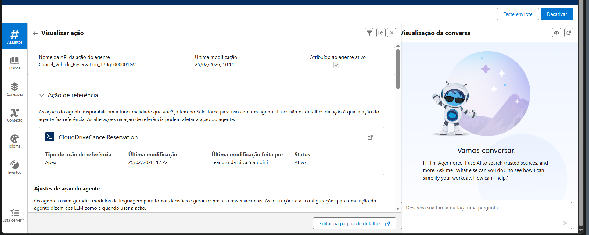 
 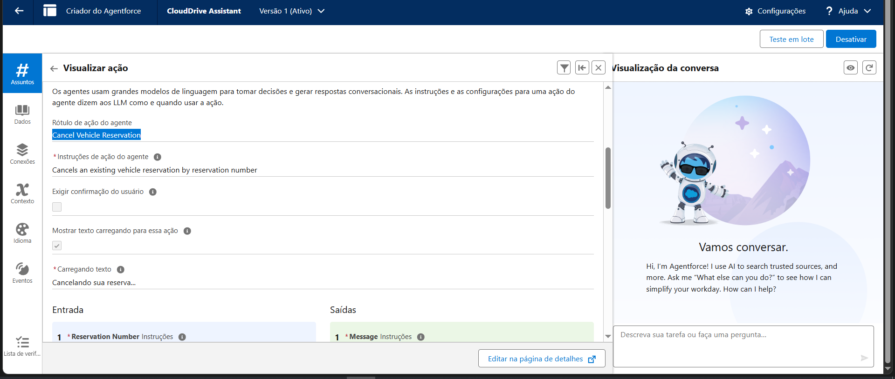 
 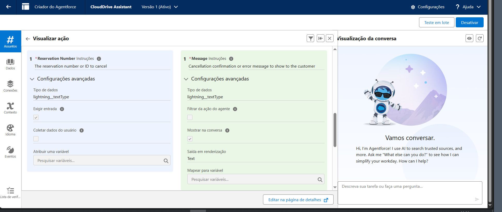 
 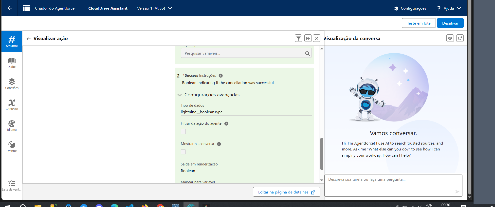 

---

### Configuração da Action Create Vehicle Reservation

**Classe Apex:** `CloudDriveReservationActions.cls`

```apex
public with sharing class CloudDriveReservationActions {

    public class ReservationRequest {
        @InvocableVariable(required=true label='Customer Name')
        public String customerName;
        @InvocableVariable(required=true label='Vehicle Id')
        public String vehicleId;
        @InvocableVariable(required=true label='Start Date')
        public String startDateStr;
        @InvocableVariable(required=true label='End Date')
        public String endDateStr;
        @InvocableVariable(label='City')
        public String city;
    }

    @InvocableMethod(label='Create Vehicle Reservation'
        description='Creates a new vehicle reservation')
    public static List<ReservationResponse> createReservation(
            List<ReservationRequest> requests) {
        // Busca Contact por nome (LIKE)
        // Busca Vehicle__c por nome ou ID, filtra por cidade
        // Calcula custo total: DailyRate__c × dias
        // Gera número único: 'RES-' + random
        // Insere Reservation__c com Status = 'Confirmed'
        // Atualiza Vehicle__c.Status__c = 'Reserved'
    }
}
```

 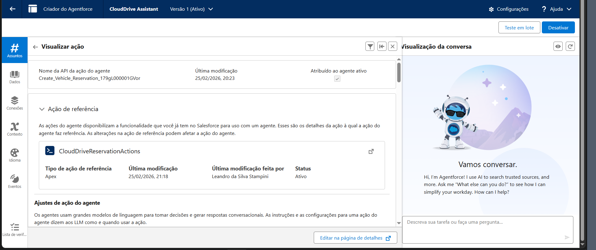 
 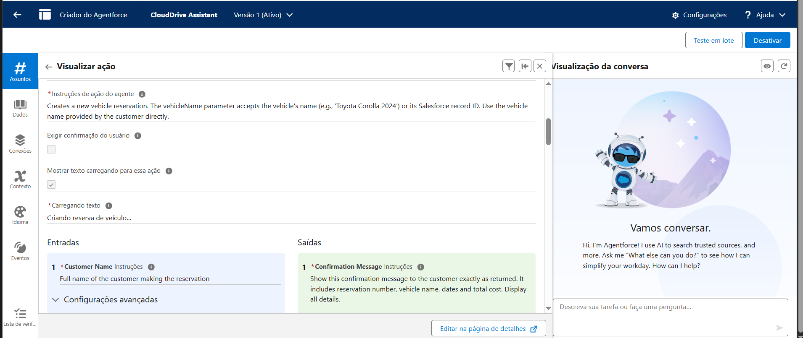 
 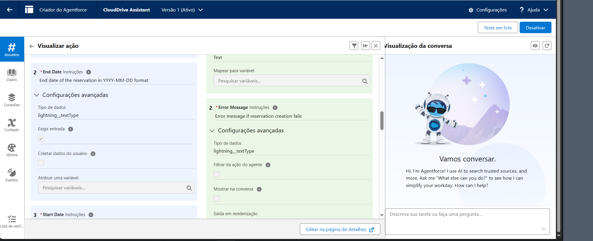 
 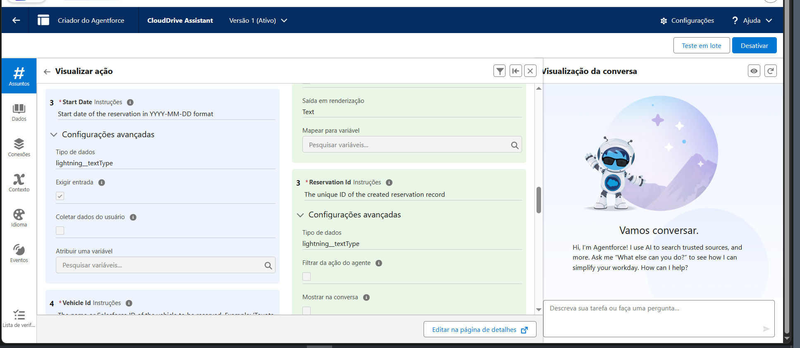 

 ---

### Configuração da Action Get Reservation Status

**Classe Apex:** `CloudDriveReservationQuery.cls`

```apex
public with sharing class CloudDriveReservationQuery {

    public class ReservationQueryRequest {
        @InvocableVariable(required=true label='Reservation Number'
            description='Numero da reserva para consultar (ex: R-001)')
        public String reservationNumber;
    }

    @InvocableMethod(label='Get Reservation Status'
        description='Consulta uma reserva de veiculo pelo numero de confirmacao')
    public static List<ReservationQueryResponse> getReservationStatus(
            List<ReservationQueryRequest> requests) {
        // Busca por Reservation_Number__c, Name ou LIKE parcial
        // Retorna: veículo, status, datas, custo total
        // Resposta formatada com todos os detalhes
    }
}
```

 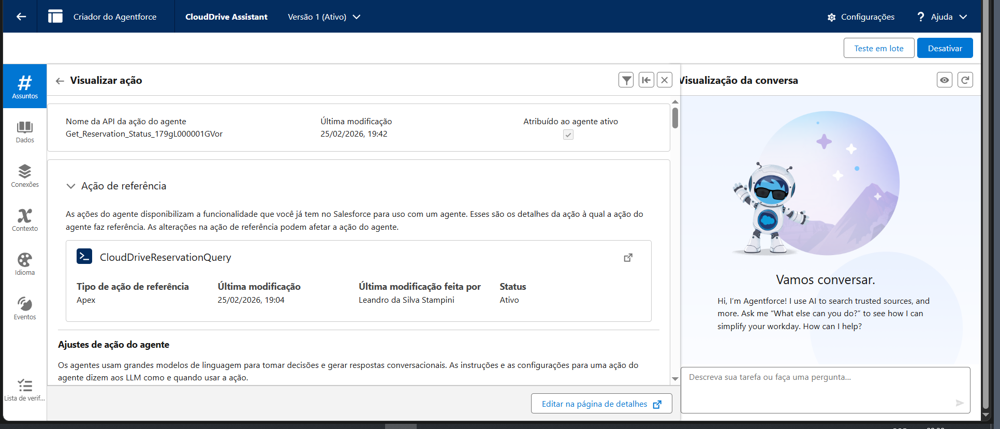 
 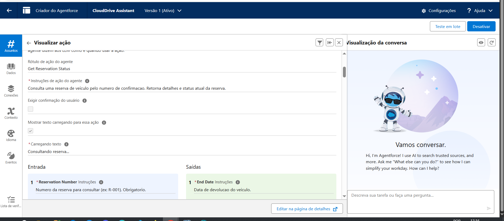 
 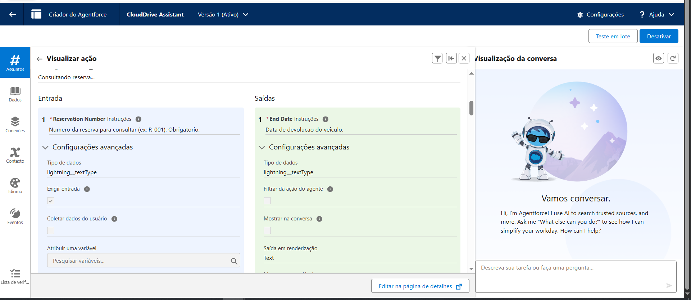 
 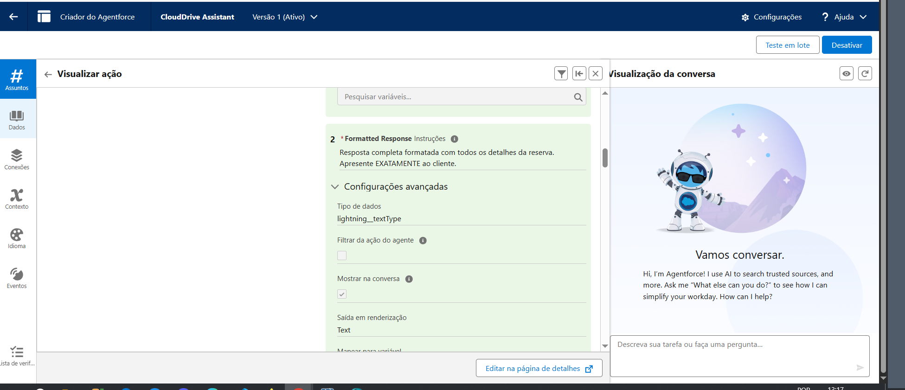 

 ---


 ### Configuração do Topic Support Ticket Creation

 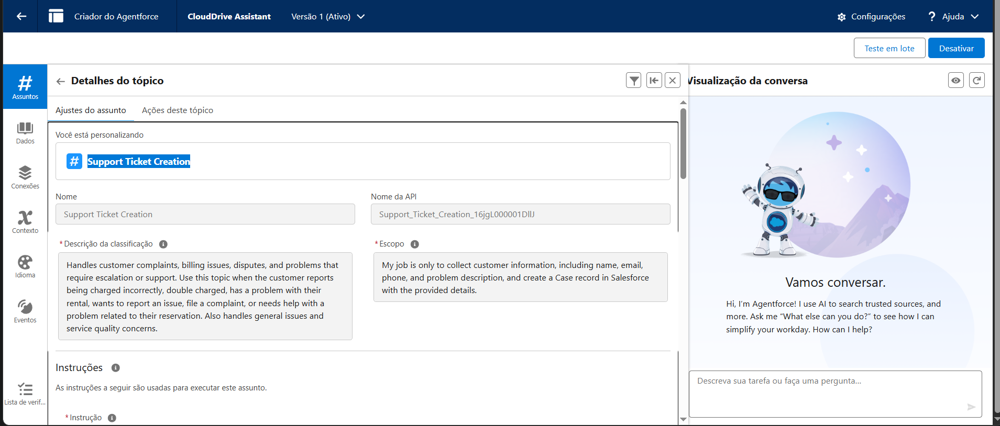 
 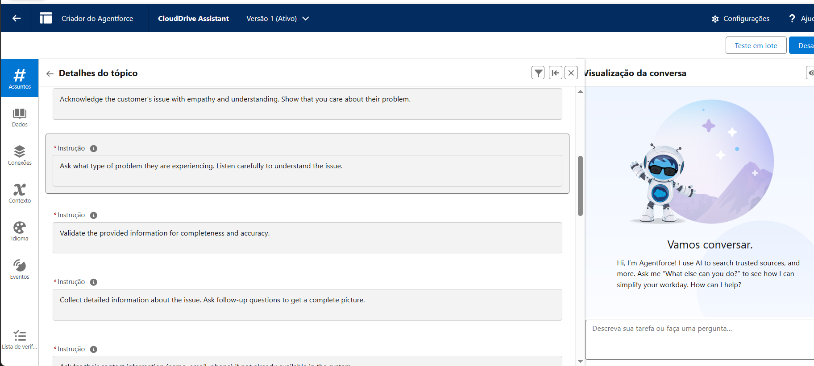 

---
### Configuração da Action Abrir Chamado de Suporte

**Classe Apex:** `CloudDriveSupportActions.cls`

```apex
public with sharing class CloudDriveSupportActions {

    public class CreateCaseRequest {
        @InvocableVariable(required=true label='Subject')
        public String subject;
        @InvocableVariable(required=true label='Description')
        public String description;
        @InvocableVariable(label='Contact Email')
        public String contactEmail;
        @InvocableVariable(label='Reservation Number')
        public String reservationNumber;
        @InvocableVariable(label='Priority')
        public String priority;
    }

    @InvocableMethod(label='Create Support Ticket'
        description='Creates a support case in Salesforce for the customer')
    public static List<CreateCaseResponse> createCase(
            List<CreateCaseRequest> requests) {
        // Cria Case com Origin = 'Agentforce'
        // Associa reserva ao assunto: Subject + ' [Reserva: RES-XXX]'
        // Prioridade padrão: Medium
        // Retorna CaseNumber e mensagem de confirmação formatada
    }
}
```

 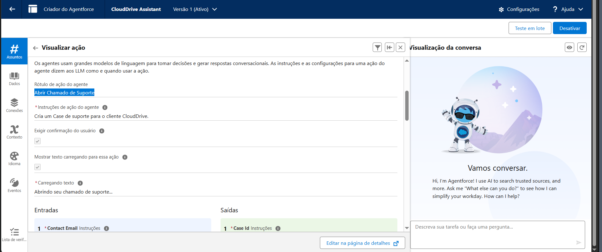 
 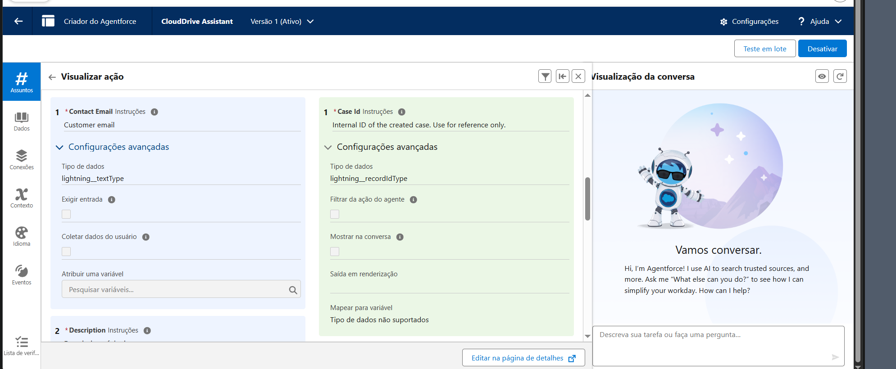
 ---

### Configuração da Action Escalate to Human Agent

**Classe Apex:** `CloudDriveEscalationActions.cls`

```apex
public with sharing class CloudDriveEscalationActions {

    public class EscalationRequest {
        @InvocableVariable(required=true label='Customer Email')
        public String customerEmail;
        @InvocableVariable(required=true label='Issue Description')
        public String issueDescription;
        @InvocableVariable(label='Reservation Number')
        public String reservationNumber;
        @InvocableVariable(label='Priority')
        public String priority;
    }

    @InvocableMethod(label='Escalate to Human Agent'
        description='Creates a support case and escalates to a human agent')
    public static List<EscalationResponse> escalateToHuman(
            List<EscalationRequest> requests) {
        // Busca Contact por email
        // Cria Case com Origin = 'Agentforce'
        // Vincula ContactId e AccountId se encontrados
        // Inclui reserva na descrição se informada
    }
}
```

 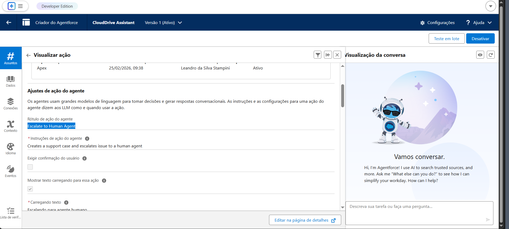 
 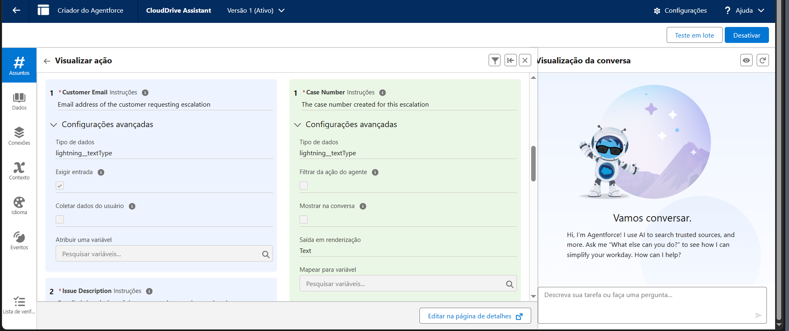

 ---


 ### Configuração do Topic Policy Information

 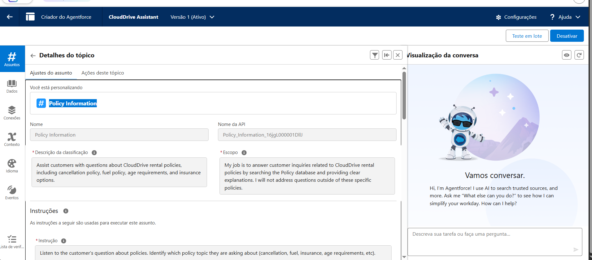 
 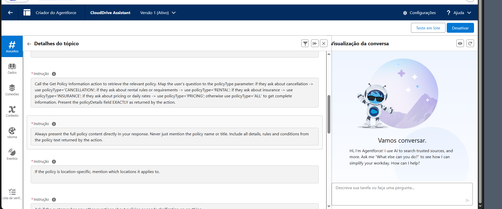 

---

### Configuração da Action Submit Customer Feedback

**Classe Apex:** `CloudDriveFeedbackActions.cls`

```apex
public with sharing class CloudDriveFeedbackActions {

    public class FeedbackRequest {
        @InvocableVariable(required=true label='Reservation Number')
        public String reservationNumber;
        @InvocableVariable(required=true label='Rating'
            description='Rating from 1 to 5')
        public Integer rating;
        @InvocableVariable(label='Comments')
        public String comments;
    }

    @InvocableMethod(label='Submit Customer Feedback'
        description='Records customer feedback and rating for a completed reservation')
    public static List<FeedbackResponse> submitFeedback(
            List<FeedbackRequest> requests) {
        // Valida rating (1-5)
        // Busca Reservation__c por número
        // Insere Feedback__c com Rating__c e Comments__c
        // Mensagem personalizada conforme nota
    }
}
```

 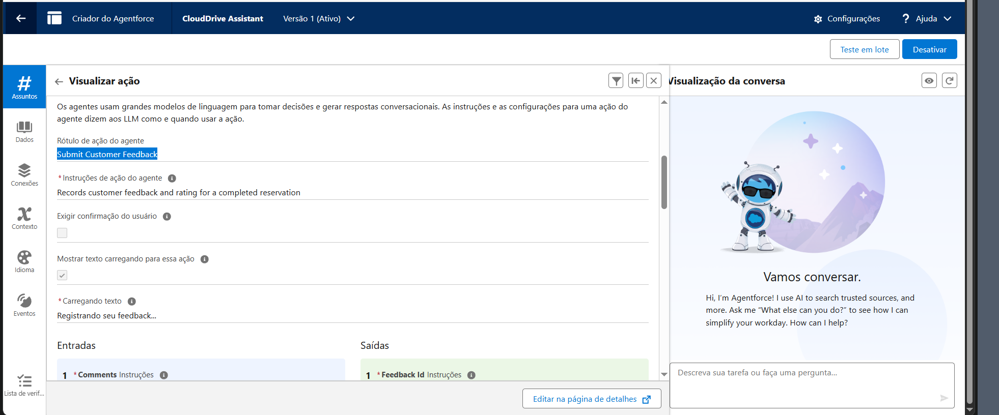 
 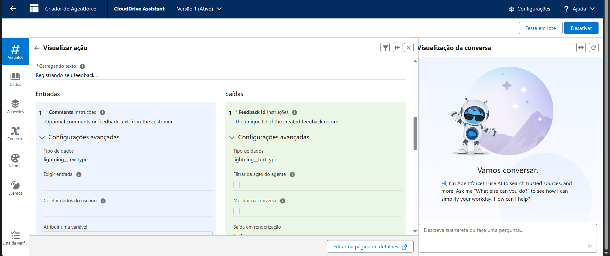
 
 ---


### Configuração da Action Get Policy Information

**Classe Apex:** `CloudDrivePolicyActions.cls`

```apex
public with sharing class CloudDrivePolicyActions {

    public class PolicyRequest {
        @InvocableVariable(label='Policy Type'
            description='RENTAL, CANCELLATION, INSURANCE, PRICING ou ALL')
        public String policyType;
        @InvocableVariable(label='Vehicle Category')
        public String vehicleCategory;
    }

    @InvocableMethod(label='Get Policy Information'
        description='Retorna informacoes sobre politicas da CloudDrive')
    public static List<PolicyResponse> getPolicyInfo(
            List<PolicyRequest> requests) {
        // Retorna políticas hardcoded:
        // RENTAL: idade mínima, CNH, cancelamento (grátis >48h, 20% 24-48h, 50% <24h)
        // INSURANCE: Básico (incluso), Intermediário (+R$30/dia), Premium (+R$55/dia)
        // PRICING: Economy R$89-120, Standard R$120-180, SUV R$180-280, Luxury R$350-600
    }
}
```

 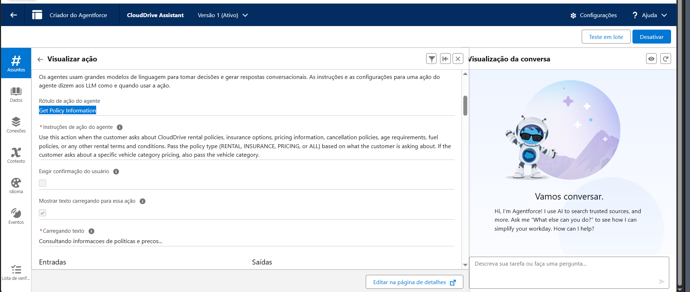 
 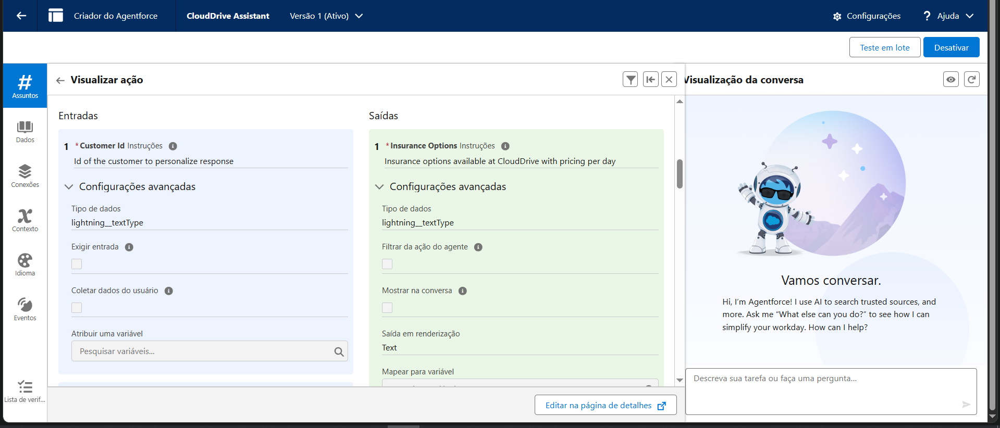
 
 ---

  ### Configuração do Topic Customer Registration

 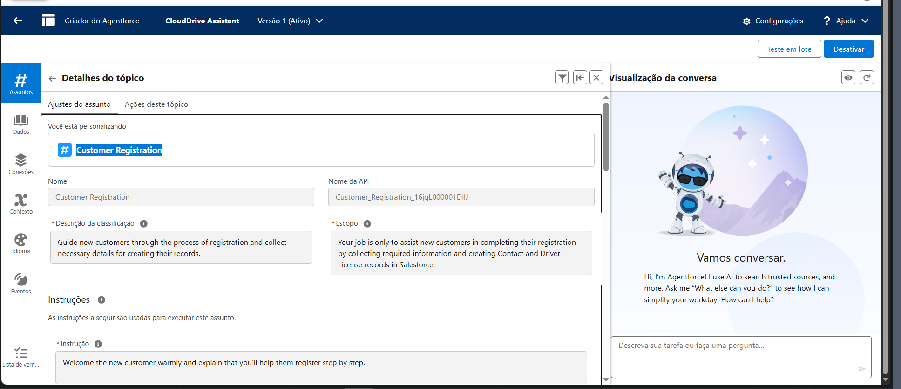 
 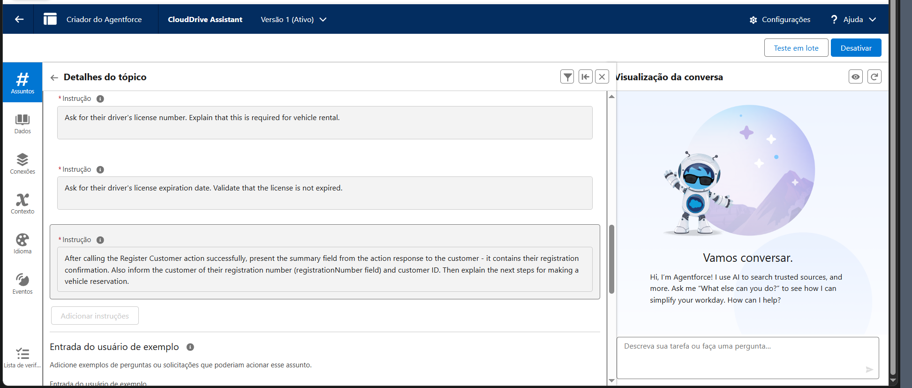 
 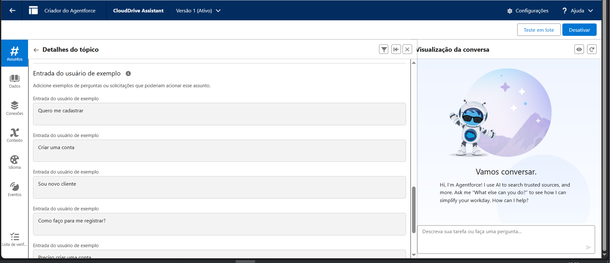 

---

### Configuração da Action Get Customer Context

**Classe Apex:** `CloudDriveAgentContext.cls`

```apex
public with sharing class CloudDriveAgentContext {

    public class CustomerContextRequest {
        @InvocableVariable(required=true label='Customer Email')
        public String customerEmail;
    }

    @InvocableMethod(label='Get Customer Context'
        description='Retrieves current customer context including active reservations and history')
    public static List<CustomerContextResponse> getCustomerContext(
            List<CustomerContextRequest> requests) {
        // Busca Contact por email
        // Consulta Reservation__c ativas (Status = 'Confirmed' ou 'Active')
        // Retorna: nome, reservas ativas, total de reservas, última reserva
        // Gera contextSummary com resumo completo
    }
}
```

 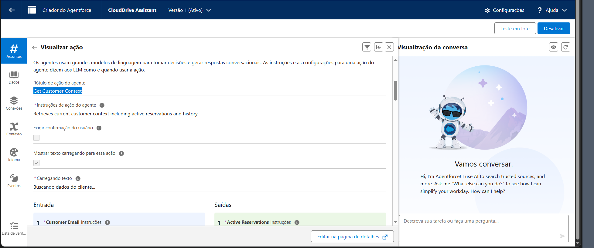 
 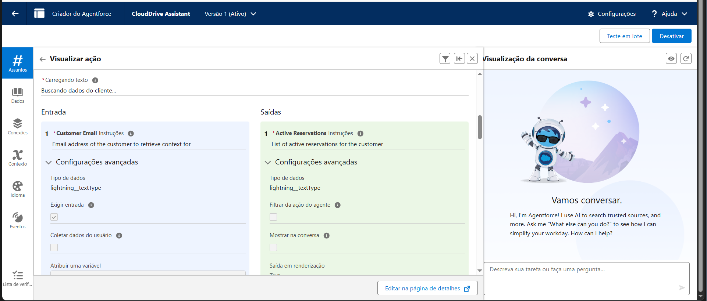
 
 ---
### Configuração da Action Register Customer

**Classe Apex:** `CloudDriveCustomerRegistration.cls`

```apex
public with sharing class CloudDriveCustomerRegistration {

    public class RegistrationRequest {
        @InvocableVariable(required=true label='Full Name')
        public String fullName;
        @InvocableVariable(required=true label='Email')
        public String email;
        @InvocableVariable(label='Phone')
        public String phone;
        @InvocableVariable(label='CPF')
        public String cpf;
        @InvocableVariable(label='Drivers License')
        public String driversLicense;
    }

    @InvocableMethod(label='Register Customer'
        description='Registers a new customer in the CloudDrive system')
    public static List<RegistrationResponse> registerCustomer(
            List<RegistrationRequest> requests) {
        // Verifica duplicidade por email
        // Faz parsing do nome em FirstName + LastName
        // Cria Contact com CPF e CNH no Description
        // Gera número de cadastro: 'CD-' + timestamp
    }
}
```

  
 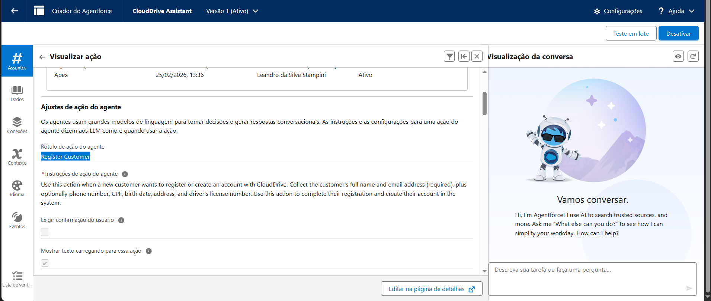
 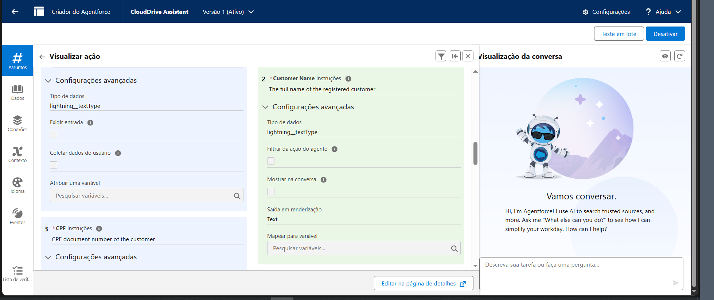  
 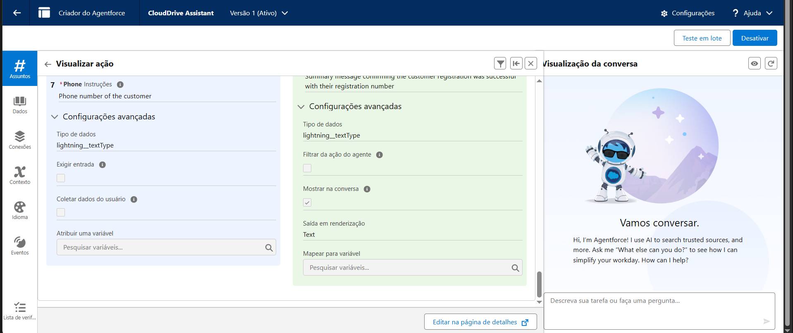   
 ---

### 🎬 Demonstração — Conversa com o Agent

> Vídeo demonstrando o funcionamento do Agent resolvendo os problemas propostos no desafio.

https://github.com/user-attachments/assets/VIDEO_ID


---

## 👨‍💻 Autor

**Leandro da Silva Stampini**

---

<p align="center">
  <em>Desenvolvido como parte do Agentforce Implementation Challenge</em><br/>
  
</p>

